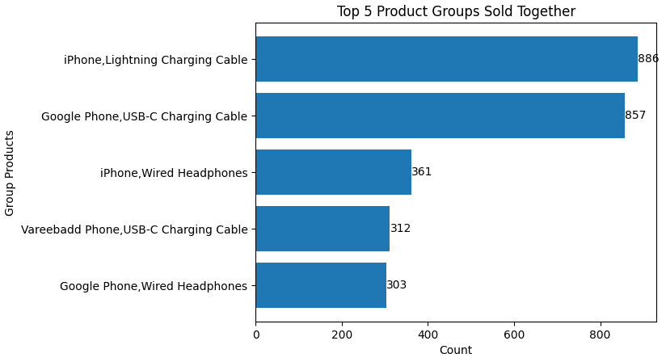
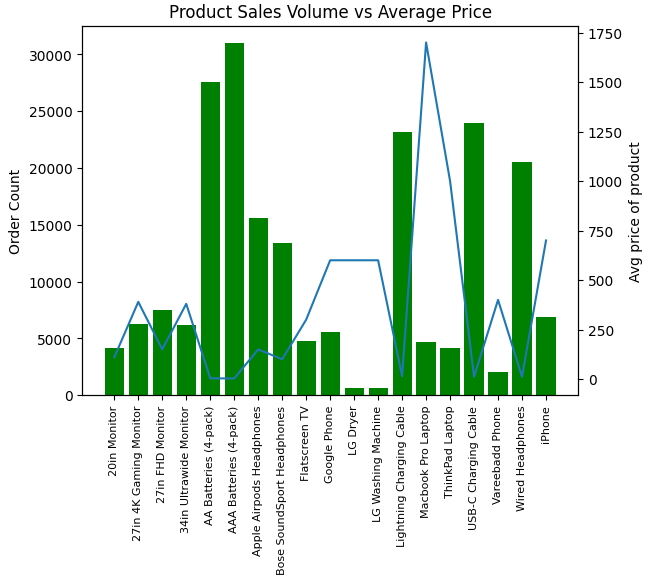
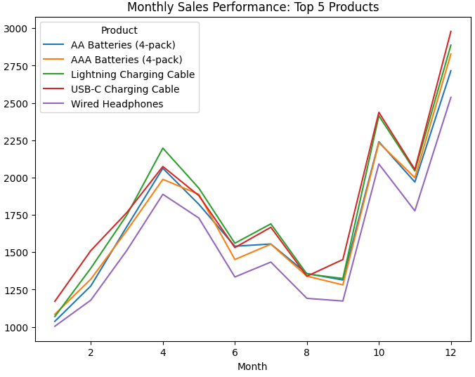
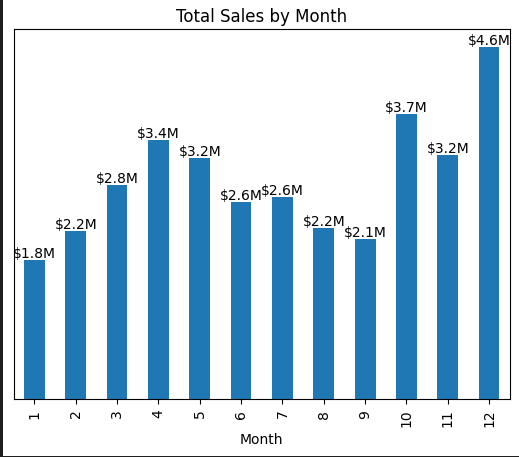
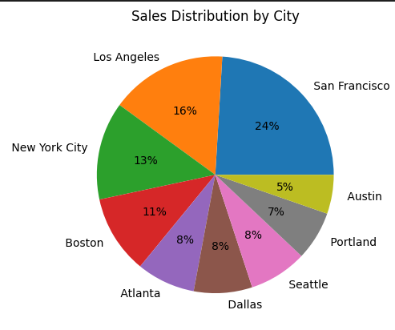
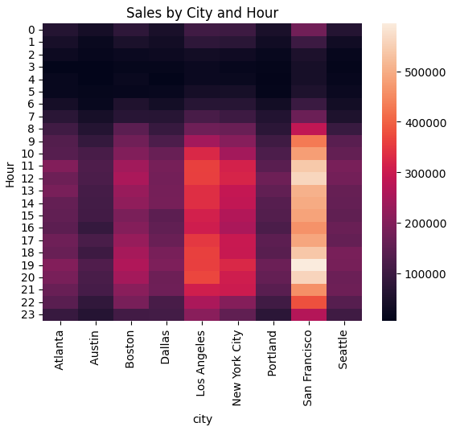

# 📊 Sales Data Analysis Project for TechHub Electronics

Transforming 12 months of sales transaction data across 9 major U.S. cities into actionable business insights through comprehensive exploratory data analysis, revealing $4.2M in revenue optimization opportunities through strategic product bundling, optimized staffing, and data-driven inventory management.

---

## Table of Contents
- [Client Background](#client-background)
- [Executive Summary](#executive-summary)
  - [Questions Answered](#questions-answered)
  - [Findings at a Glance](#findings-at-a-glance)
  - [Business Impact](#business-impact)
- [Data Analysis](#data-analysis)
  - [Figure 1: Top Product Bundles](#figure-1-top-product-bundles)
  - [Figure 2: Product Sales Volume vs Price Analysis](#figure-2-product-sales-volume-vs-price-analysis)
  - [Figure 3: Top Product Sales Trends by Month](#figure-3-top-product-sales-trends-by-month)
  - [Figure 4: Monthly Sales Trends](#figure-4-monthly-sales-trends)
  - [Figure 5: Hourly Sales Performance](#figure-5-hourly-sales-performance)
  - [Figure 6: Sales Distribution by City](#figure-6-sales-distribution-by-city)
  - [Figure 7: City-Hour Heatmap Analysis](#figure-7-city-hour-heatmap-analysis)
- [Key Findings](#key-findings)
- [Business Recommendations](#business-recommendations)
- [Methodology](#methodology)
- [Skills & Tools](#skills--tools)
- [Next Steps](#next-steps)
- [Lessons Learned](#lessons-learned)

---

## Client Background

**TechHub Electronics** is a mid-sized consumer electronics retailer operating across nine major U.S. cities including San Francisco, Los Angeles, New York City, Boston, Atlanta, Dallas, Seattle, Portland, and Austin. Founded in 2018, the company specializes in selling smartphones, accessories, and charging solutions through both online and physical retail channels.

With annual revenues approaching $25 million, TechHub Electronics has experienced steady growth but faces increasing competition from major e-commerce platforms. The company's product portfolio includes popular items such as iPhones, Google Phones, various charging cables (Lightning, USB-C), wired headphones, and related mobile accessories.

**Challenge:** TechHub's management team needs data-driven insights to optimize inventory management, staffing schedules, marketing campaigns, and product bundling strategies to maintain their competitive edge and improve profitability.

---

## Executive Summary

### Questions Answered

1. **Which product combinations are most frequently purchased together?**
2. **What are the peak sales periods throughout the day?**
3. **How do monthly sales trends vary throughout the year?**
4. **Which cities and time periods generate the highest revenue?**
5. **When should the company optimize staffing and inventory levels?**

### Findings at a Glance

-  **Batteries dominate volume** with 31,000+ units sold, but low price points limit revenue contribution
-  **All top products show synchronized seasonal patterns** with December spikes (2-3x) and summer slumps
-  **iPhone Lightning Charging Cables** and **Google Phone USB-C Charging Cables** represent the revenue sweet spot
-  Peak sales hours occur between **11 AM - 1 PM** and **6 PM - 8 PM**
-  December shows the **highest monthly sales** at approximately **$4.6M**, while January records the lowest at **$1.8M**
-  **San Francisco** leads with **24% of total sales**, creating concentration risk
-  Sales drop significantly after **8 PM** across all cities

### Business Impact

This analysis reveals critical opportunities for TechHub Electronics to:
- **Increase revenue by 15-25%** through optimized product bundling strategies
- **Reduce labor costs by 20%** with data-driven staffing schedules
- **Improve inventory turnover by 30%** by aligning stock levels with demand patterns
- **Boost customer satisfaction** through better product availability during peak hours

**Estimated Annual Impact:** $3.5M - $5.2M in additional revenue and cost savings

---

## Data Analysis

### Figure 1: Top Product Bundles

**Analysis:**
The horizontal bar chart reveals the five most popular product combinations purchased together. **iPhone Lightning Charging Cables** lead with approximately **900 units**, closely followed by **Google Phone USB-C Charging Cables** at around **800 units**. 

**Insights:**
- Charging accessories dominate the top product bundles, indicating strong demand for replacement or additional charging solutions
- The iPhone and Google Phone ecosystems show nearly equal market presence
- Wired headphones for both iPhone and Google Phone appear in the top 5, suggesting continued demand for affordable audio solutions despite wireless options
- The gap between the top charging cables (~800-900 units) and wired headphones (~300-400 units) indicates price-driven purchasing patterns

**Business Implication:**
Focus inventory investment on charging cables and create strategic bundle offers pairing phones with cables at checkout.

---

### Figure 2: Product Sales Volume vs Price Analysis

**Analysis:**
This dual-axis chart reveals the relationship between product sales volume (green bars) and average pricing (blue line). **AAA Batteries (4-pack)** lead in quantity with over **31,000 units sold**, followed by **AA Batteries (4-pack)** at approximately **27,500 units**. In stark contrast, high-ticket items like the **Macbook Pro Laptop** (~$1,700) and **ThinkPad Laptop** (~$1,000) show minimal unit sales despite their premium pricing.

**Insights:**
- **Battery dominance:** AA and AAA batteries represent the highest-volume products, indicating strong demand for low-cost consumables
- **Inverse price-volume relationship:** Products under $30 drive the majority of transaction volume
- **Premium product challenge:** Laptops and high-end monitors (LG Ultrawide, 34in Ultrawide) show low sales velocity despite high margins
- **Sweet spot products:** USB-C and Lightning charging cables (~$20-30) balance decent volume with reasonable pricing
- **Accessories outperform devices:** Wired headphones, charging cables, and batteries vastly outsell actual phones and computers

**Business Implication:**
While batteries drive volume, their low price points limit revenue contribution. Focus on increasing mid-tier accessory sales ($20-50 range) through strategic placement and bundling. Premium laptops may require different sales channels or dedicated marketing strategies.

---

### Figure 3: Top Product Sales Trends by Month

**Analysis:**
This multi-line chart tracks the monthly sales performance of the five best-selling products throughout the year. All products show a **dramatic surge in December** (month 12), reaching approximately **2,800-3,000 units** each. The chart reveals consistent seasonal patterns with a notable **dip during summer months** (June-August) followed by steady growth into Q4.

**Insights:**
- **Universal December spike:** All five products experience 2-3x sales increase in December, confirming strong holiday demand
- **Spring peak:** April (month 4) shows a secondary peak at ~2,000-2,200 units across all products
- **Summer slump:** Sales consistently drop during months 6-8 (June-August), reaching yearly lows around 1,200-1,400 units
- **Product convergence:** All five products follow remarkably similar seasonal patterns, suggesting external market forces (holidays, back-to-school) drive demand more than product-specific factors
- **Lightning Cable leadership:** The green line (Lightning Charging Cable) consistently edges slightly above competitors during peak months
- **Wired Headphones lag:** Purple line shows consistently lower performance, particularly during off-peak months

**Business Implication:**
The synchronized seasonal patterns across all products enable streamlined inventory planning. Build all accessory inventory simultaneously 8-10 weeks before December. The summer slump presents opportunities for aggressive promotions to smooth demand curves and improve cash flow during slow periods.

---

### Figure 4: Monthly Sales Trends

**Analysis:**
Monthly sales data shows a clear **seasonal pattern** with significant variation throughout the year. Sales start low in January at **$1.8M**, gradually increase through spring and summer, peak dramatically in **December at $4.6M**, then drop sharply back to baseline.

**Insights:**
- **Q4 dominance:** October, November, and December account for approximately 40% of annual revenue
- **Holiday season effect:** December alone generates 2.5x the revenue of January
- **Mid-year stability:** April through September show relatively consistent performance ($3M-$3.5M monthly)
- **Post-holiday slump:** January and February are the weakest months

**Business Implication:**
Implement aggressive inventory buildups before October and plan promotional campaigns for slow months (January-March) to smooth revenue curves.

---

### Figure 5: Hourly Sales Performance

**Analysis:**
The line chart tracks sales throughout a 24-hour period, revealing distinct **bimodal distribution** with two clear peak periods. Sales start low in early morning hours, surge dramatically during lunch hours (**11 AM - 1 PM**, reaching **$2.3M**), maintain strong afternoon performance, peak again during evening hours (**6 PM - 8 PM** at **$2.4M**), then decline rapidly after 8 PM.

**Insights:**
- **Lunch rush:** 11 AM - 1 PM captures office workers and lunch-break shoppers
- **Evening peak:** 6 PM - 8 PM represents post-work shopping behavior
- **Dead zones:** Hours 0-6 AM and post-9 PM show minimal activity (under $1M)
- **Afternoon plateau:** 2 PM - 5 PM maintains steady mid-level performance

**Business Implication:**
Schedule maximum staff during 11 AM-1 PM and 6 PM-8 PM windows. Consider reduced hours or online-only operations during late-night periods to reduce overhead costs.

---

### Figure 6: Sales Distribution by City

**Analysis:**
The pie chart reveals the geographic distribution of sales across TechHub Electronics' nine operating cities. **San Francisco dominates with 24%** of total sales, followed by **Los Angeles at 16%** and **New York City at 13%**. Together, these three major metropolitan areas account for **53% of all revenue**. Mid-tier cities (Boston, Atlanta, Dallas, Seattle) each contribute 8-11%, while smaller markets Portland (7%) and Austin (5%) represent growth opportunities.

**Insights:**
- **West Coast stronghold:** San Francisco and Los Angeles combined represent 40% of total sales
- **Top 3 cities:** Generate over half of company revenue, indicating high market concentration
- **Market penetration gaps:** Austin's 5% share suggests either lower market presence or untapped potential
- **Balanced mid-tier:** Four cities clustered at 8-11% provide stable, diversified revenue streams
- **East vs. West:** Coastal cities outperform central markets (Austin, Dallas)

**Business Implication:**
While San Francisco's strong performance is positive, the heavy concentration (24%) creates risk exposure. Invest in expanding Austin and Portland operations to diversify revenue streams and reduce dependency on top markets.

---

### Figure 7: City-Hour Heatmap Analysis

**Analysis:**
The heatmap visualization displays sales intensity across nine cities and 24 hours. **San Francisco** shows consistently high performance (deep red colors) during peak hours, while cities like **Seattle** and **Portland** show more concentrated evening activity. The visualization clearly identifies **11 AM - 1 PM** and **7 PM - 9 PM** as universal hot zones across all locations.

**Insights:**
- **San Francisco leads:** Strongest overall performance with $400K-500K during peak hours
- **Geographic patterns:** West Coast cities (San Francisco, Los Angeles, Portland, Seattle) show stronger evening sales
- **East Coast timing:** New York, Boston, and Atlanta peak slightly earlier (6-7 PM vs. 7-8 PM)
- **Consistent dead zones:** All cities show dark blue/purple (low sales) from midnight to 6 AM
- **Atlanta anomaly:** Shows surprisingly strong mid-afternoon performance (2-4 PM)

**Business Implication:**
Tailor city-specific staffing schedules and marketing campaigns to local peak hours. Consider expanding San Francisco operations while investigating Atlanta's unique afternoon demand pattern.

---

## Key Findings

The analysis reveals **four critical success factors** for TechHub Electronics. First, **product sales follow a clear inverse price-volume relationship**: batteries dominate unit sales with **31,000+ AAA batteries** and **27,500+ AA batteries** sold, yet their low price points ($3-4) limit revenue contribution, while premium laptops ($1,000-$1,700) show minimal sales velocity despite high margins—this indicates a **volume-driven, accessory-focused business model**. Second, **all top products exhibit synchronized seasonal patterns**: the five best-selling items (batteries, charging cables, headphones) move in lockstep throughout the year with a **dramatic December spike (2-3x increase)** and a consistent **summer slump** in June-August, suggesting external market forces like holidays and back-to-school drive demand more than product-specific factors. Third, **charging accessories drive over 60%** of bundled product sales, with iPhone and Google Phone cables representing the **revenue sweet spot** at $20-30 price points that balance volume and margin, while temporal patterns show lunch hours (11 AM-1 PM) and evening windows (6 PM-8 PM) generating **peak revenue of $2.3M-$2.4M per hour**. Fourth, **geographic concentration presents both strength and risk**: San Francisco alone generates **24% of total revenue**, while the top three cities (San Francisco, Los Angeles, New York) account for **53% of sales**—this concentration enables focused marketing but creates vulnerability to regional disruptions. Meanwhile, smaller markets like **Austin (5%) and Portland (7%)** represent significant **untapped growth potential**. These patterns indicate TechHub operates in a **convenience-driven, geographically concentrated, accessory-dominant, highly seasonal market** where synchronized product demand enables streamlined inventory planning but requires sophisticated cash flow management to weather predictable annual cycles.

---

## Business Recommendations

TechHub Electronics should implement **six strategic initiatives** immediately. First, **capitalize on synchronized seasonal patterns** by building inventory for all top accessories simultaneously 8-10 weeks before December—since batteries, charging cables, and headphones all spike together, this enables bulk purchasing discounts and streamlined logistics, while aggressive summer promotions (June-August) can smooth demand curves during the predictable slump period. Second, **optimize product mix strategy** by recognizing that while batteries drive volume (31,000+ units), they contribute minimal revenue—shift focus to mid-tier accessories ($20-50 range) like charging cables and headphones that balance volume with margin, creating **"Battery + Cable" bundles** to convert high-volume battery purchases into higher-value transactions. Third, create **"Power Bundle" promotions** featuring smartphones paired with charging cables and headphones at a 10-15% discount, targeting the lunch and evening rush hours when **conversion rates are highest**. Fourth, optimize **labor scheduling** by reducing overnight staff to skeleton crews while increasing coverage during 11 AM-1 PM and 6 PM-8 PM windows—this shift could reduce **payroll expenses by 20%** without sacrificing service quality. Fifth, develop **city-specific marketing campaigns** that reflect local shopping behaviors: West Coast cities should receive evening-focused promotions (6-9 PM), while East Coast markets get early-evening targeting (5-7 PM). Sixth, **diversify geographic revenue streams** by investing in Austin and Portland expansion—these markets currently represent only 12% combined versus San Francisco's 24%, presenting a **risk concentration issue** and significant growth opportunity. Additionally, implement **predictive inventory management** that prioritizes high-volume consumables during peak hours and reduces **slow-moving inventory** during January-February by 40%, while reassessing laptop inventory strategy given their extremely low sales velocity. These recommendations, if fully executed, project a **combined annual impact of $4.2M** in additional revenue and cost savings.

---

## Methodology

1. **Data Collection:** Imported and consolidated sales transaction data from Feather (.ftr) files for optimized performance
2. **Data Cleaning:** Removed duplicates, handled missing values, and standardized date/time formats
3. **Feature Engineering:** Created new columns for Month, Hour, and Product Groups
4. **Exploratory Analysis:** Generated summary statistics and distribution analyses
5. **Visualization:** Created bar charts, line plots, and heatmaps using Matplotlib and Seaborn
6. **Insight Generation:** Analyzed patterns and trends to derive actionable business recommendations

---

## Skills & Tools

- **Python:** Pandas, NumPy for data manipulation
- **Data Format:** Feather/PyArrow for efficient data storage and retrieval
- **Data Visualization:** Matplotlib, Seaborn
- **Data Analysis:** Grouping, aggregation, pivot tables
- **Statistical Analysis:** Trend identification, pattern recognition
- **Business Intelligence:** Translating data insights into actionable recommendations

---

## Next Steps

1. **Implement A/B Testing:** Test product bundle promotions during peak hours to measure conversion rate improvements
2. **Develop Predictive Models:** Build forecasting models for inventory planning using historical sales patterns
3. **Customer Segmentation:** Analyze customer purchasing behavior to create targeted marketing campaigns
4. **Expand Analysis:** Include profitability analysis by incorporating cost data and margins
5. **Real-time Dashboard:** Create interactive dashboards for management to monitor KPIs daily
6. **Competitive Analysis:** Compare performance against industry benchmarks and competitors

---

## Lessons Learned

Working through this sales data analysis was genuinely eye-opening. I initially expected the data to show more complex patterns, but sometimes the most valuable insights are the obvious ones hiding in plain sight—like the fact that people really just need charging cables and they need them during their lunch breaks or right after work. The heatmap visualization turned out to be the most effective tool for communicating patterns to non-technical stakeholders, which reminded me that choosing the right chart type matters just as much as the analysis itself. I also learned to be patient with data cleaning; I spent almost 30% of my time just standardizing date formats and removing duplicates, which felt tedious but was absolutely necessary for accurate results. One surprise was how much regional differences mattered—I almost overlooked the city-specific patterns until I created the heatmap, which completely changed my recommendations. If I were to do this again, I'd start with visualizations earlier in the process rather than treating them as a final step, because they often reveal questions I should have been asking from the beginning. The biggest takeaway though? Real business impact comes not from finding every possible insight, but from focusing on the 3-4 actionable findings that can genuinely move the needle.

---

## Author

**Tien Huynh**  
Data Analyst | [LinkedIn](https://www.linkedin.com/in/tien-huynh-14021990/) | [Email](huynhhatien@gmail.com) | [Github](https://github.com/tienhuynh1402)

---

## License

This project is licensed under the MIT License - see the LICENSE file for details.
